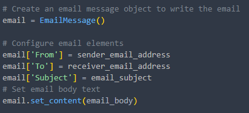
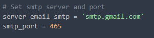

# Enviar emails con Python

**NOTA: Usare una cuenta Gmail como correo emisor.**

### Primero debemos obtener el password que nos permitirá enviar emails desde nuestra cuenta de Gmail en este proyecto.

#### Para ello primero debemos Activar la verificación en dos pasos en nuestra cuenta Gmail.

1. Dirigirse a la configuración de su cuenta en la pestaña Seguridad [https://myaccount.google.com/security](https://myaccount.google.com/security) y ubicar la sección “Acceso a Google”.
2. Seguir los siguientes pasos:
   1. Click en *Verificación en 2 pasos*.
   2. Click en  *Comenzar*, a continuacion debe ingresar la contraseña de su cuenta de gmail. 
   3. Ingresar su número celular, luego click en  *enviar* .
   4. Ingresar el código que recibió en el mensaje de texto.
   5. Por ultimo dar clic en  *ACTIVAR* .

#### Después de activar la verificacion en 2 pasos, generaremos la contraseña de aplicaciones para nuestro proyecto.

1. Dirigirse a la siguiente página [https://myaccount.google.com/u/4/apppasswords](https://myaccount.google.com/u/4/apppasswords)
2. Ingresar la contraseña de su cuenta.
3. Click en *Seleccionar app* y elegir la opción de  *Otra*. 
4. Elegir un nombre para la contraseña de aplicación, por ejemplo: *Python*.  Y dar click en  *GENERAR*. 
5. Se mostrará su contraseña de aplicación, la cual consta de 16 carácteres, guardar esta contraseña que ocuparemos más adelante.

### Una vez obtenida la contraseña de aplicaciones y activada la verificacion de 2 pasos de nuestra cuenta de correo, ¡comencemos a codificar!

#### Iniciaremos creando un entorno virtual en Python

1. Abrimos CMD, nos ubicamos en el directorio donde deseamos crearlo.
2. Escribimos los siguientes comandos para crearlo y activarlo:

- ***python -m venv nombredelentorno***
- ***nombredelentorno\Scripts\activate.bat*** (el comando anterior es para Windows, para Mac/Linux sería  ***source nombredelentorno/bin/actívate***)

#### Dentro del entorno virtual instalamos las bibliotecas necesarias para este proyecto

* ***pip install python-dotenv***

  * [python-dotenv](https://pypi.org/project/python-dotenv/) nos permite leer valores tipo clave valor para poder usarlos como variables de entorno.
* ***pip install python-decouple***

  * [Python-decouple](https://pypi.org/project/python-decouple/)  ayuda a organizar su configuración para que
    pueda cambiar los parámetros sin tener que volver a implementar su aplicación.
    Permite tener una configuración en común y poder usar las variables como
    variables de entorno.

**NOTA**: Python cuenta por default con 2 bibliotecas que nos facilitaran el envío de correos electronicos, la biblioteca ***smtplib***, esta nos permite enviar correos electrónicos a través del protocolo SMTP (Simple Mail Transfer Protocol) y  ***email.message*** la cual nos permitira crear un objeto tipo email.

#### Código

1. En el archivo **main** importamos las bibliotecas y módulos necesarios 

* ***os*** , la cual nos permitirá acceder a las variables de entorno,
* **load_dotenv**, para cargar las variables de entorno,
* **config**, modulo para acceder a las variables de entorno,
* **EmailMessage**, para crear un objeto tipo Email,
* **ssl**, brinda acceso a la seguridad de la capa de transporte y las funciones de autenticación de pares para los sockets de red, tanto del lado del cliente como del lado del servidor.
* **smtplib**, define un objeto de sesión de cliente SMTP que se puede usar para enviar correo
  electrónico.

2. Creamos un archivo tipo  **.env** , en el que escribiremos las variables de entorno, en este caso el corre del emisor y la contraseña que obtuvimos de la cuenta de Gmail (en el paso 1). 

    NOTA: ocupamos las variables de entorno para no colocar datos sensibles directamente. 

3. Continuamos en el archivo main, cargando las variables de entorno 
4. Colocamos los datos necesarios para enviar un email: correo del emisor, contraseña del correo emisor y el correo del destinatario. 

***NOTA***: Podemos leer variables de entorno usando ***library os*** o haciendo uso de  ***library python-deocuple*** . El método *os.getenv()* de la biblioteca ***OS*** solo devuelve cadenas, mientras que el método *config()* de la biblioteca ***decouple*** puede retornar otros tipos de datos además de cadenas.
Para este proyecto usaremos *decouple* porque es más práctica.

Usando la biblioteca  *OS* , quedaría así  

5. Configuramos el cuerpo de nuestro mensaje, definimos el subject y el body. 
6. Usando la clase *EmailMessage* creamos un objeto que nos permitirá formar el email y asignamos los datos que le corresponden a cada elemento que conforma un email.  
7. Creamos una capa de seguridad SSL .
8. Para crear un objeto *SMTP*  necesitamos el servidor del correo y el puerto que vamos a utilizar, los definimos

    

* El servidor a utilizar dependerá de su proveedor de correo electrónico, este es para Gmail.
  * [Lista de servidores de correo smtp](https://www.arclab.com/en/kb/email/list-of-smtp-and-pop3-servers-mailserver-list.html)
* El puerto de correo se utilizara para enviar correos  electrónicos.

9. Definimos un objeto *SMTP*  y pasamos como argumentos el servidor de correo y el puerto.
10. Nos autenticamos con nuestra cuenta de correo, pasamos como argumentos nuestro
    correo y contraseña para iniciar sesión. 
11. Una vez autenticados podremos enviar correos. Usamos el método *sendmail* y le pasamos 3 argumentos respectivamente: correo remitente, correo destinatario y el mensaje.

    

15. Cerramos sesión con el servidor.

    

16. Ejecutamos el programa.

### Verificamos que nos llegó el correo.

    
